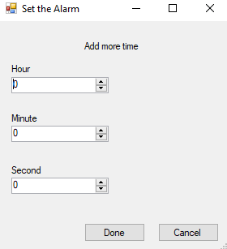
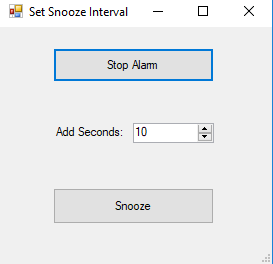
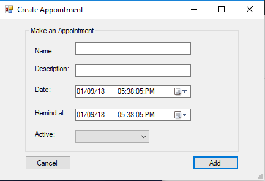
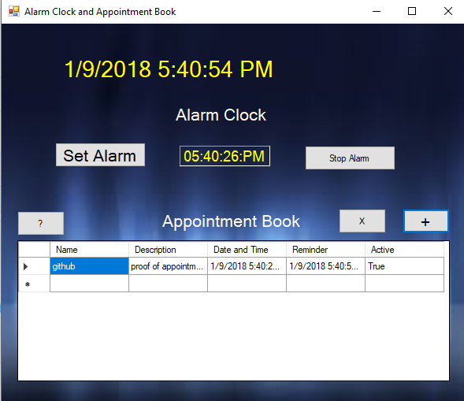
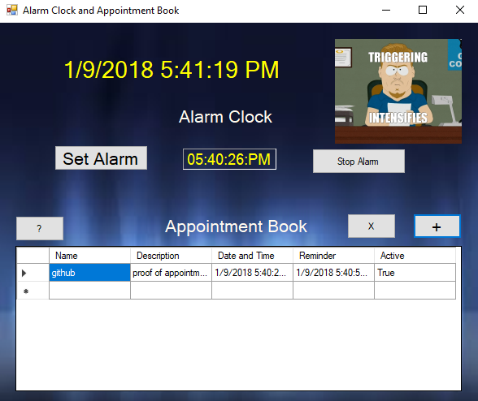

# AppointmentBook-and-AlarmClock

A GUI application for an Appointment Book and a Alarm Clock. Utilizes WinForms, audio, and visual media.

## Getting Started

These instructions will get you a copy of the project up and running on your local machine for development and testing purposes.

### Prerequisites

```
Visual Studios
```

## Running the tests

Creating an Alarm



Form pops up when alarm time is exceeded.



Creating an Appointment



Appointment Made



Appointment Alarm Gif Appearing



## Author

**Steven Duong**
